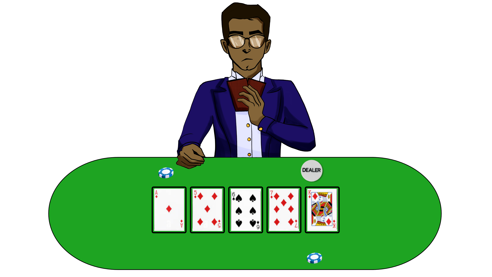
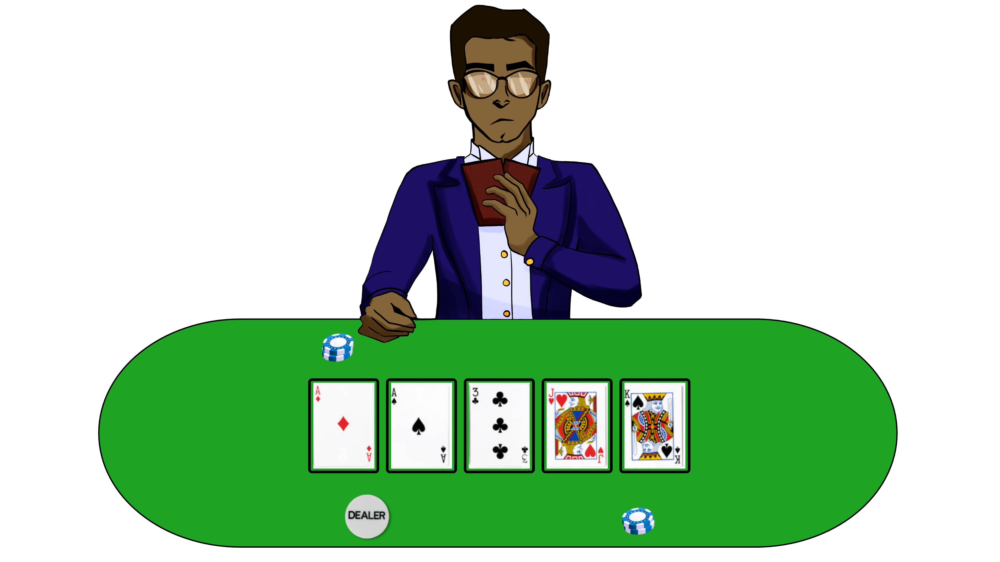
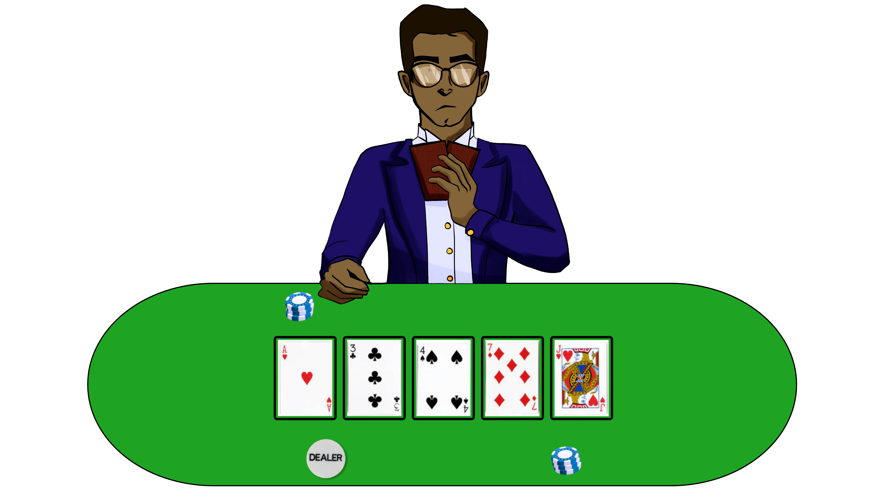
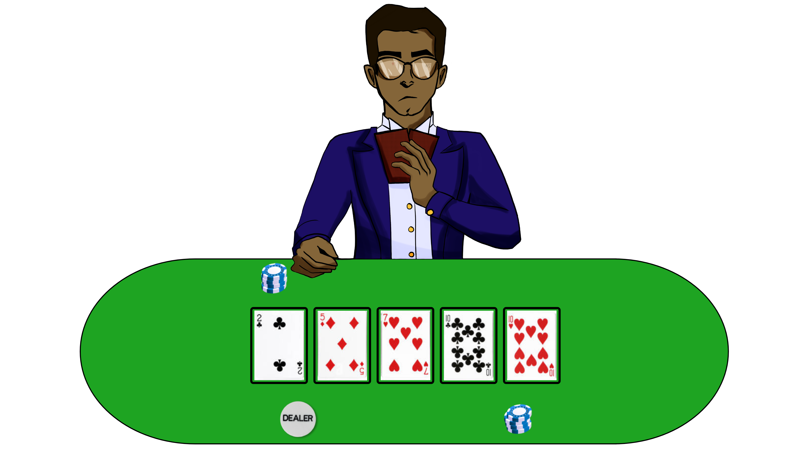
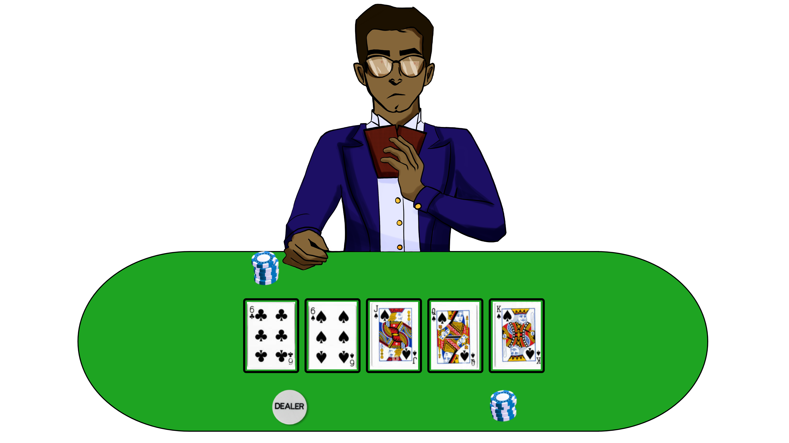
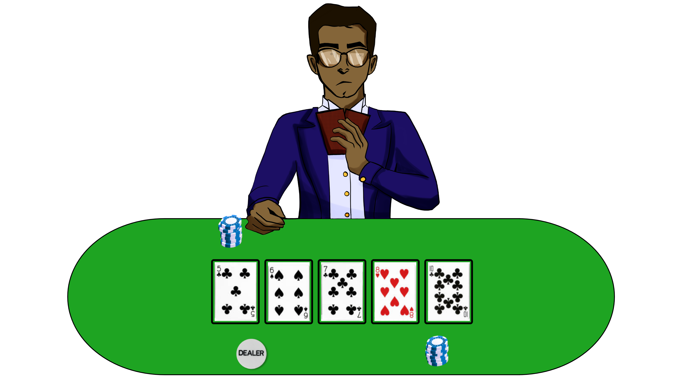
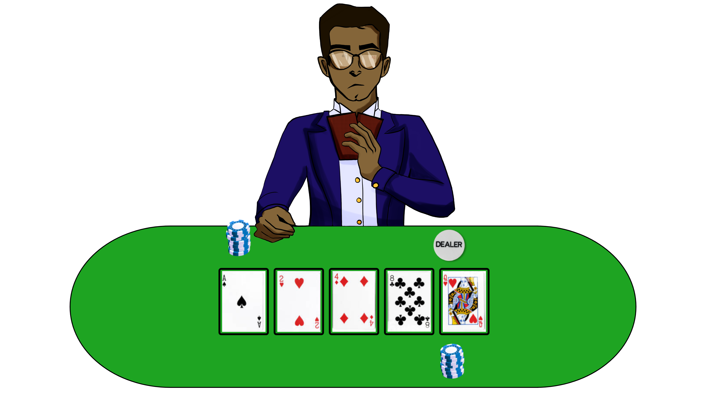

Doubling up with your seven lucky cards down your sleeves, you're sure
to clean house, as long as you keep rank and conceal your con from the
eagle-eyed dealer.

How can you discover what Carter was up to at the casino?

