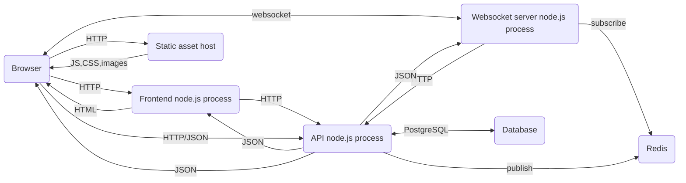

# Architecture

This site does not make use of any particular modern frontend framework. We
evaluated several, and concluded that it would be very difficult to ensure that
we would not leak the existence of particular URLs, code chunks, or other
potentially sensitive information via manifests or other implementation
details. In particular, most modern frontend frameworks want client-side
routing, which involves the client knowing what to do with any particular URL,
which implies the client knowing a priori the universe of URL patterns that can
be matched and what code to fetch for each. This was at odds with our goals
around progressively revealing hunt content.

Instead, we have pieced together assorted tools that have been widely deployed,
with an emphasis on making sure we are able to more carefully control what data
and code are made available to solvers.

Our system is currently assembled out of several components:

- A database (Postgres in production, SQLite in development) which stores our canonical data (see [../src/api/db.ts](../src/api/db.ts))
- A pubsub system (currently Redis)
- An OpenAPI-compatible API server implemented in TypeScript (see [../lib/api/](../lib/api/) and [../src/api](../src/api/)). It authenticates requests via JWTs and custom headers, and accepts and returns JSON, and publishes writes to the pubsub system.
- A frontend server implemented in TypeScript which server-side-renders React components and returns HTML with additional `<script>` tags for running scripts in the browser. This server requests team state from the API, and uses it to render e.g. round and puzzle pages.
- A websocket server implemented in TypeScript which watches pubsub (but also occasionally polls the API) and pushes realtime state updates to the browser.
- A static asset host, where we store a bunch of content-addressed assets (scripts, css, fonts, images, audio)
- The hunter's browser

I've omitted a few of our more niche bits like the audio streaming server
([`mediamtx`](https://github.com/bluenviron/mediamtx), or the IoT
command-and-control system we use for managing the radios
([`thingsboard`](https://thingsboard.io/)) since I'm trying to focus on what's
most relevant to the website and this codebase right now.

The overall architecture of our system is:

